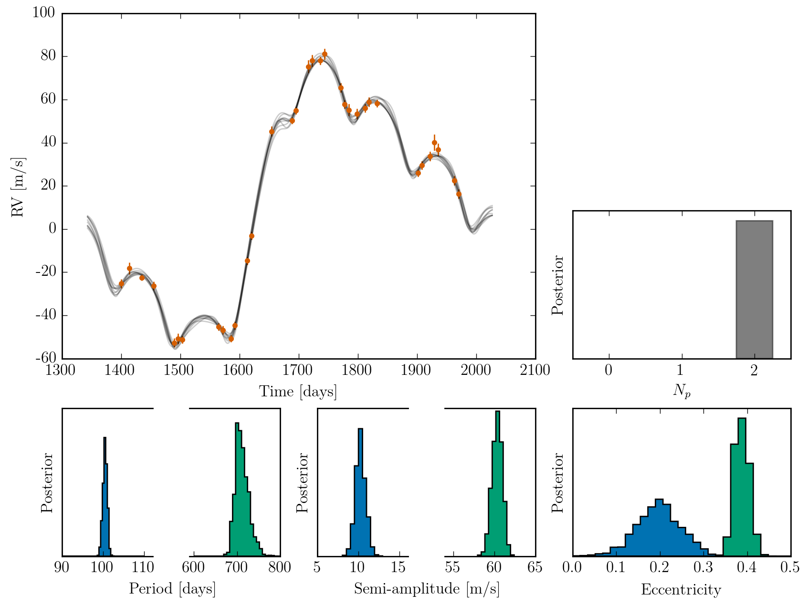

### RV analysis with DNest4 and GPs

Clone with `--recursive` to get the submodules.  
Running `make` will hopefully work. Need a fairly recent version of g++ (one that accepts `-std=c++11`)

See [the wiki](https://github.com/j-faria/kima/wiki) for more information and documentation.

