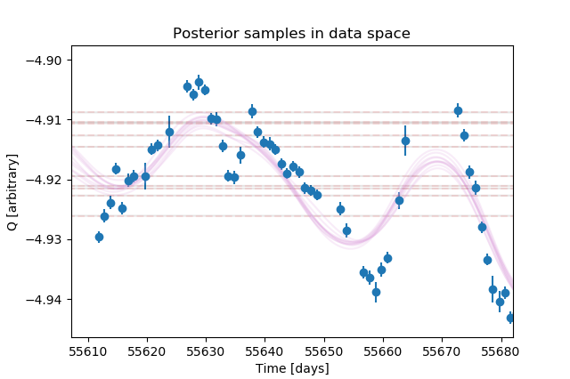

This example illustrates using **kima** for observations other than RVs.  
We fit the logR'<sub>HK</sub> activity index of HD128621 (α Cen B), as measured
by HARPS during 2010 and 2011. 


In the `kima_setup.cpp` file, we set a GP model with custom priors for
η<sub>2</sub> and η<sub>3</sub> (associated to the timescale of active region
evolution and the stellar rotation period, respectively). The number of
Keplerians is kept fixed at 0.

Providing `"arb"` (for *arbitrary*) as the units argument to the `load` function
tells **kima** that the data are not RVs. The code then tries to be agnostic in
some of the transformations tipically done to RVs and in the plots that involve
units.

> **Important**:  
> The default priors are still most appropriate to RV observations, so you may
> need to pay extra attention to them if the model misbehaves.


An interesting result from this analysis is that the GP with a standard
quasi-periodic kernel does not completely capture all observed variations
(within the priors we set):



The logR'<sub>HK</sub> is a tracer of stellar activity (especially plages) and α
Cen B is a fairly active star. It's likely that the GP kernel needs to be
adapted in order to model this very precise and well-sampled dataset.  
Using the quasi-periodic kernel from *celerite* (by setting `kernel = celerite`
in the `RVmodel` constructor<sup>1</sup>) you may get a much better fit, at the
expense of interpretability of the hyperparameters.


---

To compile and run the example, type

```
kima-run
```

With the default options, this example may take a bit less than 10 minutes to
finish, depending on your machine.


--- 

<sup>1</sup>You might also need to change the priors for η<sub>2</sub> and η<sub>3</sub>.